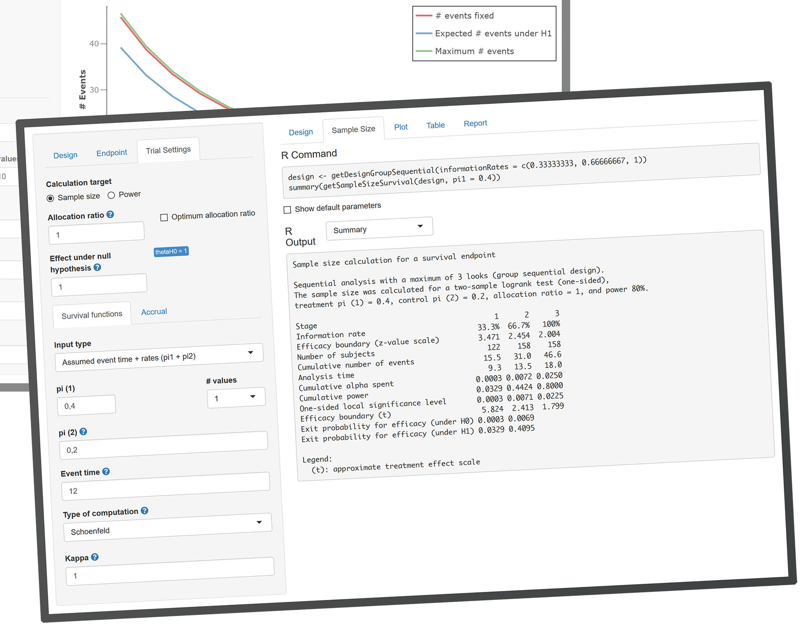

# Public rpact Shiny App

**A graphical user interface for the [rpact](https://cran.r-project.org/package=rpact) R package.**

The [rpact Shiny app](https://rpact.shinyapps.io/public) is an interactive web application designed to provide a graphical user interface for the [rpact](https://cran.r-project.org/package=rpact) R package, facilitating the design and analysis of confirmatory adaptive clinical trials, among other functionalities.

**Free Use:** The basic version of the rpact Shiny app is available free of charge. Access it [here](https://rpact.shinyapps.io/public) to start using it now.

## Bug and Issue Tracking

This [GitHub repository](https://github.com/rpact-com/rpact.shiny.public) is dedicated exclusively to bug and issue tracking related to the rpact Shiny app.

- If you encounter a bug or have a suggestion, please feel free to [create an issue](https://github.com/rpact-com/rpact.shiny.public/issues/new/choose) in the [issues section](https://github.com/rpact-com/rpact.shiny.public/issues).

Please note that the source code of the rpact Shiny app is not publicly available and is managed in a private repository.

## About rpact

**rpact** is a comprehensive, validated[^1] R package for clinical research, offering features such as:
- Design and analysis of confirmatory adaptive group sequential designs.
- A powerful sample size calculator.
- Free of charge open-source software, licensed under [LGPL-3](https://cran.r-project.org/web/licenses/LGPL-3).
- Implementation of methods described in the monograph by [Wassmer and Brannath (2016)](https://doi.org/10.1007%2F978-3-319-32562-0).

For more detailed information, please visit [www.rpact.org](https://www.rpact.org).

**RPACT** is a company offering:
- Enterprise R/Shiny software development services.
- Technical support for the rpact package.
- Consultancy and user training for scientists using R.
- Validated software solutions and R package development for clinical research.

For more detailed information, please visit [www.rpact.com](https://www.rpact.com).

[^1]: The rpact validation documentation is available exclusively to our customers and supporting members. For more information, visit [www.rpact.com/services/sla](https://www.rpact.com/services/sla).
